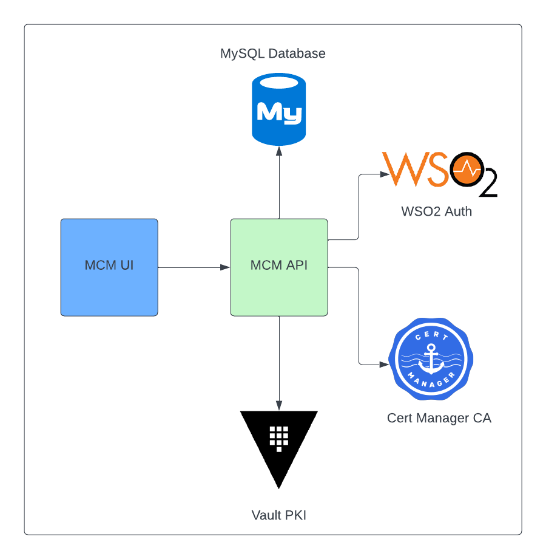

# Connection Manager API

[](https://github.com/modusbox/connection-manager-api/actions/workflows/releaseWorkflow.yml)




Connection Manager API is a component of the Mojaloop ecosystem that allows an administrator to manage the network configuration and PKI information for the Hub and a set of DFSPs.

It provides a REST API, described using a [Swagger/OpenAPI document](./src/api/swagger.yaml).

The API servers uses OAuth2 to implement security, as defined in the [OAuth2 implementation doc](./oauth2.md)

## DFSP onboarding process using MCM

Here you can find a [document and video describing the onboarding processs using MCM](https://infitx.atlassian.net/wiki/spaces/CS/pages/18776713/SOP0009+-+HUB+PM4ML+-+On-boarding+Payment+Manager+v.0.1-20220307)

## Running the server locally

You'll need a db instance available. you can setup one by running:
```./scripts/run-mysql.sh```

now install dependencies:
```npm ci```

install vault:
```./scripts/run-vault.sh```

specify a development test run:
```export TEST=true```

you can now start the service: 
```npm start```

you can go see the swagger definition at `localhost:3001`

## Configuration

There's a [Constants.js file](./src/constants/Constants.js) that pulls the values from the environment or uses defaults if not defined.

Variables:

|Environment variable|Description|Default Value
:---|:---|:---
| **MCM API server configuration**
|PORT|mcm API HTTP port|3001
| **Authentication features**
|AUTH_ENABLED|Enables support for OAuth2. 'TRUE' to enable| (disabled)
|AUTH_2FA_ENABLED|Enables two-factor authentication 'TRUE' to enable| (disabled)
| **OAuth2 roles**
|MTA_ROLE|DFSP Admin role|'Application/MTA'
|PTA_ROLE|HUB Admin Role|'Application/PTA'
|EVERYONE_ROLE|Authenticated users role|'Internal/everyone'
| **WSO2 OAuth Service Provider configuration**
|APP_OAUTH_CLIENT_KEY|OAuth2 Client Key. Configured in WSO2 IM Service Provider|
|APP_OAUTH_CLIENT_SECRET|OAuth2 Client Secret. Configured in WSO2 IM Service Provider|
|CERTIFICATE_FILE_NAME|WSO2 **Service Provider** Public Certificate filename. If the value starts with `/` it will be read as an absolute path, otherwise as a relative path to the app dir|'resources/wso2carbon-publickey.cert'
|EMBEDDED_CERTIFICATE|WSO2 **Service Provider** Public Certificate PEM-encoded string. This one has priority over the previous var|
| **WSO2 OAuth server configuration**
|OAUTH2_ISSUER|OAuth token issuer endpoint. This service will connect to this endpoint to request the JWTs |https://WSO2_IM_SERVER:9443/oauth2/token
|OAUTH2_TOKEN_ISS|JWTs have an `iss` property. This property is usually the same as the endpoint (`OAUTH2_ISSUER`), but it may differ for example if there's an HTTP gateway with a different endpoint in between. You can use `OAUTH2_TOKEN_ISS` to specify the expected value of the `iss` property. This service validates that the value of the `iss` property on the JWT it receives on the API calls either is equal to either OAUTH2_ISSUER or OAUTH2_TOKEN_ISS; if there's no match then authentication will fail with a 401.|
| **Database configuration**
|DATABASE_HOST|mysql host|localhost
|DATABASE_PORT|mysql port|3306
|DATABASE_USER|mysql user|mcm
|DATABASE_PASSWORD|mysql password|mcm
|DATABASE_SCHEMA|mysql schema|mcm
|DB_RETRIES|Times the initial connection to the DB will be retried|10,
|DB_CONNECTION_RETRY_WAIT_MILLISECONDS|Pause between retries|5000,
|RUN_MIGRATIONS|If true, run db schema migration at startup. Can always be true as the schema creation is idempotent|true,
|CURRENCY_CODES|Path to file containing all the supported currency codes|'./data/currencyCodes.json',
|DATA_CONFIGURATION_FILE|Initial data configuration path. See specific doc|'./data/sampleConfiguration.json'
| **WSO2 custom services configuration**
|TOTP_ADMIN_ISSUER|URL of TOTP Admin (WSO2)|
|TOTP_ADMIN_AUTH_USER|user of TOTP Admin|
|TOTP_ADMIN_AUTH_PASSWORD|pass of TOTP Admin|
|TOTP_LABEL|a label to be shown with 2FA|
|TOTP_ISSUER|a issuer to be shown with 2FA|MCM
|WSO2_MANAGER_SERVICE_URL|URL of WSO2 Manager Service|
|WSO2_MANAGER_SERVICE_USER|user of WSO2 Manager Service|
|WSO2_MANAGER_SERVICE_PASSWORD|pass of WSO2 Manager Service|
|OAUTH_RESET_PASSWORD_ISSUER|URL of reset password issuer (WSO2)|
|OAUTH_RESET_PASSWORD_AUTH_USER|user of WSO2 reset password service (WSO2)|
|OAUTH_RESET_PASSWORD_AUTH_PASSWORD|password of WSO2 reset password service (WSO2)|
| **MCM Internal Certificate Authority configuration**
|P12_PASS_PHRASE|Pass phrase used to save the internal CA Key in the DB.|
| **Support for self-signed certificates on OAuth Server and other TLS client connections**
|EXTRA_CERTIFICATE_CHAIN_FILE_NAME|Extra trusted server certificate chain file name ( PEM-encoded, as explained in https://nodejs.org/api/tls.html#tls_tls_createsecurecontext_options )|
|EXTRA_ROOT_CERT_FILE_NAME|Extra trusted server root certificate file name|

## Authentication

User authentication can be enabled using WSO2. The service is able to login, change password and logout. WSO2 Configuration must be set in place using the above ENV variables.

You can refer to the Auth [README](oauth2.md)

## Cert Renewal

When Registering or changing a CA, the API will use the Cert-Manager CRD to renew the Certificate.

## Testing

- Run integration tests:
  - `npm run test`

### Functioanl Tests

Refer to [the functional tests README](./test/functional-tests/README.md).
